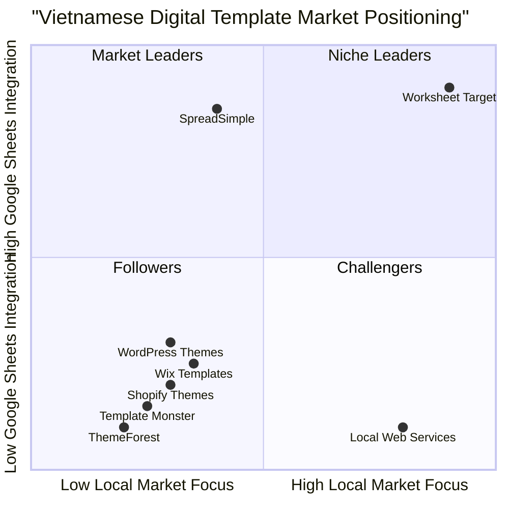

# Product Requirements Document (PRD)
## Worksheet - Vietnamese Digital Products E-commerce Platform

**Document Version:** 1.0  
**Date:** August 18, 2025  
**Language:** Vietnamese/English  
**Programming Languages:** Shadcn-ui, TypeScript, Tailwind CSS  
**Project Name:** worksheet_ecommerce_platform  

### Original Requirements Restatement
Create a complete, fully functional, production-ready e-commerce website named "Worksheet" that sells digital products (pre-built website templates managed via Google Sheets) with both customer-facing interface and admin dashboard, strictly adhering to Google Material Design principles and Vietnamese market requirements.
## 1. Product Definition

### 1.1 Product Goals

**Goal 1: Market Leadership in Vietnamese Digital Templates**
- Establish Worksheet as the premier marketplace for Google Sheets-integrated website templates in Vietnam
- Achieve 25% market share of Vietnamese digital template sales within 12 months
- Build brand recognition as the trusted platform for professional, code-free website solutions

**Goal 2: Seamless User Experience & Conversion Optimization**
- Achieve checkout conversion rate above 30% (significantly higher than Vietnam's average 20%)
- Reduce cart abandonment to below 65% (compared to Vietnam's 70%+ average)
- Provide intuitive, mobile-first experience matching Vietnamese user preferences

**Goal 3: Scalable Business Operations**
- Enable complete content management through admin dashboard without code changes
- Support automated customer lifecycle management and email sequences
- Integrate seamlessly with Vietnamese payment ecosystem (VietQR, Momo, ZaloPay)

### 1.2 User Stories

**US001: Template Discovery & Purchase**
As a Vietnamese small business owner, I want to easily browse and purchase website templates that integrate with Google Sheets, so that I can quickly launch my online store without technical knowledge.

**US002: Dynamic Pricing & Upsells**
As a customer, I want to see real-time price updates when I select additional features or bundles, so that I can make informed purchasing decisions and understand the total cost upfront.

**US003: Local Payment Integration**
As a Vietnamese customer, I want to pay using familiar local methods like Momo, ZaloPay, or VietQR, so that I feel secure and can complete purchases using my preferred payment method.

**US004: Admin Content Management**
As a business owner, I want to manage all website content, products, and settings through an intuitive dashboard, so that I can update my store without needing technical support.

**US005: Customer Lifecycle Management**
As a business owner, I want automated email sequences and cross-selling features, so that I can maximize customer lifetime value and build long-term relationships.

### 1.3 Competitive Analysis

**ThemeForest**
- Pros: Vast template library, established global brand, comprehensive marketplace features
- Cons: Not Vietnamese-localized, complex interface, lacks Google Sheets integration, international payment focus

**Template Monster**
- Pros: High-quality templates, good customer support, regular updates
- Cons: Premium pricing, no local payment methods, limited Vietnamese language support

**Shopify Themes Store**
- Pros: Integrated with popular e-commerce platform, good mobile optimization
- Cons: Requires Shopify subscription, not standalone, limited customization without code

**Local Vietnamese Web Design Services**
- Pros: Local market understanding, personal service, Vietnamese language support
- Cons: High costs, long delivery times, not self-service, limited scalability

**SpreadSimple**
- Pros: Google Sheets integration, user-friendly, good template quality
- Cons: Limited Vietnamese localization, foreign payment methods, no local market focus

**Wix Template Gallery**
- Pros: Easy-to-use editor, good mobile responsiveness, affordable pricing
- Cons: Platform lock-in, limited Vietnamese support, no Google Sheets native integration

**WordPress Theme Marketplaces**
- Pros: Flexible customization, large community, SEO-friendly
- Cons: Requires technical knowledge, complex setup, no Vietnamese payment integration

### 1.4 Competitive Quadrant Chart


## 2. Technical Specifications

### 2.1 Requirements Analysis

**Core Business Logic Requirements**
The Worksheet platform requires sophisticated e-commerce functionality specifically tailored for Vietnamese digital product sales. The system must handle complex pricing calculations with real-time updates for upsells and bundles, integrate seamlessly with Vietnamese payment gateways, and provide comprehensive content management capabilities. The unique Google Sheets integration requirement demands robust API handling and template provisioning systems.

**User Experience Requirements**
Based on Vietnamese e-commerce research showing 70%+ cart abandonment rates and mobile traffic exceeding 68%, the platform must prioritize mobile-first design with streamlined checkout processes. Vietnamese users prefer local payment methods and expect social proof elements like reviews and community integration. The interface must feel familiar through Google Material Design principles while incorporating Vietnamese cultural preferences.

**Technical Architecture Requirements**
The system requires a modern, scalable architecture supporting real-time data updates, role-based access control, and automated email sequences. Integration with multiple payment providers, Google Sheets API, and email automation services demands robust error handling and failover mechanisms. The admin dashboard must provide complete content control without code deployment.

**Performance & Scalability Requirements**
Given Vietnam's mobile-heavy usage patterns and varying internet speeds, the platform must load quickly on mobile devices with optimized images and minimal JavaScript. The system should handle traffic spikes during promotional campaigns and scale efficiently as the product catalog and user base grow.

### 2.2 Requirements Pool

**P0 Requirements (Must-Have)**

**P0-001:** Responsive mobile-first design with Google Material Design components
- Rationale: 68% of Vietnamese e-commerce traffic is mobile
- Acceptance Criteria: All features functional on mobile devices, passes Google Mobile-Friendly test

**P0-002:** Vietnamese payment integration (VietQR, Momo, ZaloPay)
- Rationale: Local payment methods are essential for Vietnamese market conversion
- Acceptance Criteria: Successful payment processing with all three methods, proper error handling

**P0-003:** Real-time dynamic pricing with upsell calculations
- Rationale: Core business requirement for bundle sales and conversion optimization
- Acceptance Criteria: Price updates instantly when options selected, accurate calculations displayed

**P0-004:** Complete admin dashboard for content management
- Rationale: Business requirement for autonomous content control
- Acceptance Criteria: All website content manageable through admin interface, no code deployment needed

**P0-005:** Functional shopping cart with quantity updates
- Rationale: Essential e-commerce functionality for user experience
- Acceptance Criteria: Add/remove items, update quantities, persist across sessions

**P0-006:** Single-page checkout process
- Rationale: Reduces cart abandonment, matches Vietnamese user preferences
- Acceptance Criteria: All checkout steps on one page, form validation, payment processing

**P0-007:** Product search and filtering functionality
- Rationale: Essential for product discovery in template marketplace
- Acceptance Criteria: Search by keywords, filter by categories, real-time results

**P0-008:** Order confirmation and customer communication
- Rationale: Required for business operations and customer satisfaction
- Acceptance Criteria: Confirmation emails sent, order status tracking, customer notifications

**P1 Requirements (Should-Have)**

**P1-001:** Automated email sequence system
- Rationale: Improves customer lifecycle management and revenue
- Acceptance Criteria: Welcome emails, follow-up sequences, upsell campaigns

**P1-002:** Social proof and review system
- Rationale: Vietnamese consumers heavily rely on reviews for purchase decisions
- Acceptance Criteria: Star ratings, customer reviews, testimonial display

**P1-003:** Cross-sell and upsell recommendations
- Rationale: Increases average order value, common in successful Vietnamese e-commerce
- Acceptance Criteria: Related products shown, bundle recommendations, cart upsells

**P1-004:** Campaign and discount management
- Rationale: Vietnamese shoppers motivated by promotions and discounts
- Acceptance Criteria: Discount codes, promotional campaigns, time-limited offers

**P1-005:** Customer management and order history
- Rationale: Essential for customer service and repeat purchase optimization
- Acceptance Criteria: Customer profiles, purchase history, support ticket system

**P2 Requirements (Nice-to-Have)**

**P2-001:** Livestream commerce integration
- Rationale: Vietnam emerging as major live commerce market
- Acceptance Criteria: Live streaming capability, real-time product showcase

**P2-002:** AI-powered product recommendations
- Rationale: Personalization improves conversion rates
- Acceptance Criteria: Personalized product suggestions, browsing behavior analysis

**P2-003:** Social media integration and sharing
- Rationale: Social media important for brand awareness in Vietnam
- Acceptance Criteria: Share buttons, social login, content syndication

**P2-004:** Advanced analytics and reporting
- Rationale: Business intelligence for growth optimization
- Acceptance Criteria: Sales reports, customer analytics, conversion tracking
### 2.3 UI Design Draft

**Design System Foundation**
- **Color Palette:** Strict adherence to specified colors with Background White (#F9F9F9), Container White (#FFFFFF), Text Charcoal (#202124), Primary Accent Green (#34A853), Secondary Accent Blue (#4285F4), Call-to-Action Orange (#FBBC05)
- **Typography:** Roboto font family with specific hierarchy - H1: 48px Bold Green, H2: 36px Bold Green, H3: 24px Semi-bold Blue, Body: 16px Regular Charcoal
- **Components:** Material Design Icons library, consistent spacing using 8px grid system

**Homepage Layout Structure**
```
┌─────────────────────────────────────────────────────────────┐
│ Header: Logo (Green) | Navigation (Blue) | Cart Icon         │
├─────────────────────────────────────────────────────────────┤  
│ Hero Section (Background White):                            │
│   H1: "Tạo website chuyên nghiệp từ Google Sheet" (Green)  │
│   Subtitle + Search Bar + CTA Button (Orange)              │
├─────────────────────────────────────────────────────────────┤
│ Featured Categories (Container White Cards):                │
│   3 clickable category cards with icons and descriptions   │
├─────────────────────────────────────────────────────────────┤
│ Best-Selling Combo (Container White):                      │
│   Special pricing display + "Add to Cart" (Orange)        │
├─────────────────────────────────────────────────────────────┤
│ Product Grid (Container White Cards):                      │
│   Template thumbnails + pricing + "View Details" (Blue)    │
└─────────────────────────────────────────────────────────────┘
```

**Product Detail Page Layout**
```
┌─────────────────────────────────────────────────────────────┐
│ Breadcrumb Navigation (Blue links)                         │
├─────────────────────────────────────────────────────────────┤
│ Left Column (50%):        │ Right Column (50%):             │
│ ┌─────────────────────────┤ ┌─────────────────────────────┐   │
│ │ Video Demo (Container)  │ │ Product Name (H2, Green)    │   │
│ │ Image Gallery          │ │ Price Display (Large)       │   │
│ └─────────────────────────┤ │ Upsell Checkboxes:         │   │
│                          │ │ □ Premium Design (+150k)   │   │
│                          │ │ □ Auto Payment (+200k)     │   │
│                          │ │ "Add to Cart" (Orange)     │   │
│                          │ └─────────────────────────────┘   │
├─────────────────────────────────────────────────────────────┤
│ Frequently Bought Together (Container White)               │
│ Social Proof & Reviews Section                             │
└─────────────────────────────────────────────────────────────┘
```

**Shopping Cart Modal**
```
┌─────────────────────────────────────────────────────────────┐
│ Cart Header + Close Button                                 │
├─────────────────────────────────────────────────────────────┤
│ Item 1: Image | Name | Price | Quantity +/- | Remove       │
│ Item 2: Image | Name | Price | Quantity +/- | Remove       │
├─────────────────────────────────────────────────────────────┤
│ Shipping Threshold Message (if applicable)                 │
│ Subtotal Display                                           │
│ "Checkout" Button (Orange) | "Continue Shopping" (Blue)    │
└─────────────────────────────────────────────────────────────┘
```

**Admin Dashboard Layout**
```
┌─────────────────────────────────────────────────────────────┐
│ Admin Header: Logo | User Menu | Logout                    │
├─────────────────────────────────────────────────────────────┤
│ Sidebar Navigation:      │ Main Content Area:             │
│ • Dashboard             │ ┌─────────────────────────────┐ │
│ • Products              │ │ Content based on selection  │ │
│ • Orders                │ │                             │ │
│ • Customers             │ │                             │ │
│ • Campaigns             │ │                             │ │
│ • Settings              │ │                             │ │
│                         │ └─────────────────────────────┘ │
└─────────────────────────────────────────────────────────────┘
```

**Mobile Responsive Considerations**
- Stack columns vertically on mobile devices
- Enlarge touch targets to minimum 44px
- Implement swipe gestures for image galleries
- Use slide-out navigation menu for categories
- Optimize form inputs for mobile keyboards
- Ensure CTA buttons are easily thumb-accessible

### 2.4 Open Questions

**Payment Integration Specifics**
- What are the exact API requirements and sandbox environments for VietQR, Momo, and ZaloPay?
- Do we need to implement payment splitting or just standard checkout flows?
- What are the transaction fees and settlement times for each payment method?

**Google Sheets Integration Complexity**
- How complex should the Google Sheets template cloning process be?
- Do we need real-time sync or batch processing for template provisioning?
- What level of Google Sheets API access and permissions are required?

**Content Delivery and Storage**
- Where will large template files and demo videos be hosted?
- Do we need CDN integration for global content delivery?
- What are the bandwidth requirements for video demos?

**Email Automation Platform**
- Which email service provider should be integrated (SendGrid, Mailchimp, etc.)?
- What are the requirements for email template customization?
- Do we need advanced segmentation and A/B testing capabilities?

**Performance and Scaling**
- What are the expected concurrent user loads during promotional campaigns?
- Do we need caching strategies for frequently accessed product data?
- What are the database performance requirements for real-time price calculations?

**Security and Compliance**
- What PCI DSS compliance requirements apply to the payment processing?
- Do we need GDPR compliance for international customers?
- What are the specific security requirements for admin access?
## 3. Database Schema & Backend Architecture

### 3.1 Supabase Database Design

**Users Table**
```sql
CREATE TABLE users (
  id UUID PRIMARY KEY DEFAULT gen_random_uuid(),
  email VARCHAR(255) UNIQUE NOT NULL,
  full_name VARCHAR(255),
  role VARCHAR(50) DEFAULT 'customer',
  created_at TIMESTAMP DEFAULT NOW(),
  updated_at TIMESTAMP DEFAULT NOW()
);
```

**Products Table**
```sql
CREATE TABLE products (
  id UUID PRIMARY KEY DEFAULT gen_random_uuid(),
  name VARCHAR(255) NOT NULL,
  slug VARCHAR(255) UNIQUE NOT NULL,
  description TEXT,
  price DECIMAL(10,2) NOT NULL,
  original_price DECIMAL(10,2),
  thumbnail_url TEXT,
  video_demo_url TEXT,
  gallery_urls TEXT[], -- Array of image URLs
  category VARCHAR(100),
  is_featured BOOLEAN DEFAULT false,
  is_active BOOLEAN DEFAULT true,
  created_at TIMESTAMP DEFAULT NOW(),
  updated_at TIMESTAMP DEFAULT NOW()
);
```

**Product Add-ons Table**
```sql
CREATE TABLE product_addons (
  id UUID PRIMARY KEY DEFAULT gen_random_uuid(),
  product_id UUID REFERENCES products(id) ON DELETE CASCADE,
  name VARCHAR(255) NOT NULL,
  price DECIMAL(10,2) NOT NULL,
  description TEXT,
  is_active BOOLEAN DEFAULT true
);
```

**Orders Table**
```sql
CREATE TABLE orders (
  id UUID PRIMARY KEY DEFAULT gen_random_uuid(),
  user_id UUID REFERENCES users(id),
  email VARCHAR(255) NOT NULL,
  full_name VARCHAR(255) NOT NULL,
  total_amount DECIMAL(10,2) NOT NULL,
  status VARCHAR(50) DEFAULT 'pending',
  payment_method VARCHAR(50),
  payment_status VARCHAR(50) DEFAULT 'pending',
  created_at TIMESTAMP DEFAULT NOW(),
  updated_at TIMESTAMP DEFAULT NOW()
);
```

**Order Items Table**
```sql
CREATE TABLE order_items (
  id UUID PRIMARY KEY DEFAULT gen_random_uuid(),
  order_id UUID REFERENCES orders(id) ON DELETE CASCADE,
  product_id UUID REFERENCES products(id),
  product_name VARCHAR(255),
  quantity INTEGER DEFAULT 1,
  unit_price DECIMAL(10,2),
  addon_selections JSONB -- Store selected addons
);
```

**Site Settings Table**
```sql
CREATE TABLE site_settings (
  id UUID PRIMARY KEY DEFAULT gen_random_uuid(),
  key VARCHAR(100) UNIQUE NOT NULL,
  value TEXT,
  updated_at TIMESTAMP DEFAULT NOW()
);
```

**Campaigns Table**
```sql
CREATE TABLE campaigns (
  id UUID PRIMARY KEY DEFAULT gen_random_uuid(),
  name VARCHAR(255) NOT NULL,
  discount_type VARCHAR(20), -- 'percentage' or 'fixed'
  discount_value DECIMAL(10,2),
  code VARCHAR(50) UNIQUE,
  start_date TIMESTAMP,
  end_date TIMESTAMP,
  is_active BOOLEAN DEFAULT true,
  created_at TIMESTAMP DEFAULT NOW()
);
```

### 3.2 Authentication & Authorization

**Role-Based Access Control**
- **Customer Role:** Can browse products, make purchases, view order history
- **Admin Role:** Full access to dashboard, product management, customer data, settings

**Authentication Flow**
- Supabase Auth for user registration and login
- Email-based authentication with password reset
- Session management with JWT tokens
- Protected routes for admin dashboard

**Security Measures**
- Row Level Security (RLS) policies for data protection
- API rate limiting to prevent abuse
- Input validation and sanitization
- HTTPS enforcement for all connections

### 3.3 Payment Integration Architecture

**Payment Provider Abstraction**
```typescript
interface PaymentProvider {
  processPayment(orderData: OrderData): Promise<PaymentResult>;
  verifyPayment(transactionId: string): Promise<PaymentStatus>;
  refundPayment(transactionId: string, amount: number): Promise<RefundResult>;
}
```

**Vietnamese Payment Methods**
- **VietQR Integration:** QR code generation and verification
- **Momo Integration:** Deep link and API-based payments  
- **ZaloPay Integration:** Payment gateway and callback handling

**Payment Flow**
1. Customer selects payment method on checkout
2. Order created with 'pending' status
3. Payment provider API called with order details
4. Payment confirmation received via webhook
5. Order status updated to 'completed'
6. Email confirmation and product delivery triggered

### 3.4 Real-time Features

**Live Price Updates**
- WebSocket connections for real-time price calculations
- Event-driven updates when upsells are selected/deselected
- Optimistic UI updates with server-side validation

**Inventory Management**
- Real-time stock level updates (if applicable to digital products)
- Concurrent order handling with proper locking mechanisms

**Admin Dashboard Updates**
- Live order notifications
- Real-time analytics and metrics
- Instant content updates across customer-facing site
## 4. Feature Specifications

### 4.1 Customer-Facing Features

**Homepage (/)**

*Hero Section*
- **Requirement:** Implement Vietnamese headline "Tạo website chuyên nghiệp từ Google Sheet" with specified typography (48px, Bold, #34A853)
- **Functionality:** Include working search bar with placeholder "Tìm mẫu website cho ngành nghề của bạn..." that filters products in real-time
- **CTA Button:** "Bắt Đầu Ngay" button (#FBBC05 background, #FFFFFF text) that smoothly scrolls to product section
- **Acceptance Criteria:** Hero loads in <2 seconds, search returns results within 500ms, CTA scroll animation smooth on mobile

*Featured Categories*
- **Requirement:** Display 3 clickable category cards: "Website Bán Lẻ", "Website Dịch Vụ", "Website Portfolio"
- **Functionality:** Each card links to filtered product view, shows category icon and brief description
- **Visual Design:** Cards use Container White (#FFFFFF) background with subtle shadow, category names in Secondary Accent Blue (#4285F4)

*Best-Selling Combo Section*
- **Requirement:** Showcase pre-configured bundle with special pricing
- **Functionality:** Bundle card shows original vs. discounted price, single "Add to Cart" button adds entire bundle
- **Business Logic:** Bundle pricing automatically calculated based on included products plus discount percentage

*Product Grid*
- **Requirement:** Responsive grid layout showing template thumbnails, names, prices, and "View Details" buttons
- **Functionality:** Infinite scroll or pagination, hover effects on desktop, optimized touch targets on mobile
- **Performance:** Lazy loading for images, thumbnail optimization for fast loading

**Product Details Page (/product/{slug})**

*Media Gallery*
- **Requirement:** Left column (50% width) with video demo and image gallery
- **Functionality:** Video plays in modal overlay, image gallery with zoom capability, mobile swipe gestures
- **Integration:** YouTube/Vimeo embed for demo videos, optimized image delivery

*Product Information & Purchase Options*
- **Requirement:** Right column with product name (H2, #34A853), prominent price display, functional upsell checkboxes
- **Critical Functionality:** Real-time price updates when upsells selected - "Thêm Gói Giao Diện Cao Cấp (+150,000đ)", "Thêm Gói Tích Hợp Thanh Toán Tự Động (+200,000đ)"
- **Price Calculation Logic:** Base price + selected addon prices, display formatted Vietnamese currency (₫)
- **Add to Cart:** Orange button (#FBBC05) adds product with selected options to cart

*Frequently Bought Together*
- **Requirement:** Amazon-style bundle recommendation with pre-selected items
- **Functionality:** "Add Bundle to Cart" button, shows total savings, individual item removal capability
- **Business Logic:** Bundles defined in admin dashboard, automatic discount calculation

*Social Proof*
- **Requirement:** Star ratings, customer reviews, testimonials section
- **Functionality:** Review submission form for verified purchasers, helpful voting on reviews
- **Vietnamese Localization:** Review prompts in Vietnamese, cultural appropriate social proof elements

**Shopping Cart & Checkout**

*Cart Modal*
- **Requirement:** Slide-out cart accessible from header icon, shows item thumbnails, names, prices, quantities
- **Functionality:** Quantity increment/decrement buttons, item removal, subtotal calculation, persistent across sessions
- **Upsell Logic:** Dynamic shipping threshold message "Bạn chỉ cần thêm X đồng nữa để được miễn phí vận chuyển!"

*Single-Page Checkout (/checkout)*
- **Requirement:** All checkout steps on one page - customer info, order summary, payment selection
- **Form Fields:** Full Name, Email Address (with validation), payment method selection
- **Payment Integration:** Radio buttons for VietQR, Momo, ZaloPay with respective logos and instructions
- **Order Summary:** Live-updating totals, applied discounts, final amount in Vietnamese đồng
- **Completion:** "Complete Purchase" button (#FBBC05) processes payment and redirects to confirmation

**Order Confirmation (/thank-you)**

*Confirmation Details*
- **Requirement:** Order number, customer email, product access instructions
- **Functionality:** Automatic email trigger, download links or access credentials provided
- **Business Flow:** Only accessible after successful payment, prevents direct URL access

*Cross-sell Opportunity*
- **Requirement:** Time-sensitive offer for complementary product
- **Functionality:** Countdown timer, special pricing, direct purchase capability
- **Conversion Logic:** Offer expires after set time, tracks conversion rates for optimization

*Community Integration*
- **Requirement:** Facebook group invitation button
- **Functionality:** Direct link to Facebook group, tracking for community growth metrics

### 4.2 Admin Dashboard Features

**Dashboard Home (/admin/dashboard)**

*Key Metrics Display*
- **Requirement:** Revenue cards showing Total Revenue, Number of Orders, New Customers
- **Functionality:** Real-time data updates, date range filtering, visual charts for trends
- **Data Sources:** Aggregated from orders table, customer registration tracking

*Recent Orders Table*
- **Requirement:** Latest orders with customer names, order totals, status, timestamps
- **Functionality:** Clickable rows for order details, status update capability, export functionality
- **Performance:** Paginated results, real-time updates for new orders

**Product Management (/admin/products)**

*Product Listing*
- **Requirement:** Table view with columns for Thumbnail, Name, Price, Status, Actions (Edit/Delete)
- **Functionality:** Sortable columns, search/filter capability, bulk actions for multiple products
- **Visual Design:** Consistent with overall admin theme, clear action buttons

*Add/Edit Product Form*
- **Requirement:** Comprehensive form with all product fields
- **Critical Fields:**
  - Product Name: Text input with character limit
  - Description: Rich text editor (WYSIWYG) with formatting options
  - Price/Original Price: Number inputs with currency formatting
  - Thumbnail URL: Text input for image URL with preview capability
  - Video Demo URL: Text input for YouTube/Vimeo links with validation
  - Gallery URLs: Dynamic list with "Add Image URL" and "Remove" buttons
  - Add-ons: Section to define upsells with name and price fields
- **Functionality:** Form validation, image URL verification, real-time preview
- **Data Handling:** Save to products and product_addons tables, generate SEO-friendly slugs

**Campaign Management (/admin/campaigns)**

*Campaign Creation*
- **Requirement:** Interface for discount codes, promotional campaigns, featured product selection
- **Functionality:** Discount type selection (percentage/fixed), date range picker, usage limit settings
- **Integration:** Automatic application during checkout, tracking of campaign performance

*Active Campaigns*
- **Requirement:** List of current campaigns with performance metrics
- **Functionality:** Enable/disable toggles, edit capability, analytics integration

**Customer Management (/admin/customers)**

*Customer Database*
- **Requirement:** Searchable list of customers with registration dates, order history, contact information
- **Functionality:** Customer profile views, order history access, communication logging
- **Privacy:** Comply with Vietnamese data protection requirements

**Site Settings (/admin/settings)**

*Global Configuration*
- **Requirement:** Critical settings for site-wide elements
- **Essential Fields:**
  - Site Logo URL: Text input with live preview in header/footer
  - Favicon URL: Text input for browser tab icon
  - Contact Email: Email input for customer service
  - Facebook Group URL: URL input for community integration
- **Functionality:** Instant updates across customer-facing site, URL validation, backup of previous settings
- **Implementation:** Settings stored in site_settings table, cached for performance
- **Performance:** Lazy loading for images, thumbnail optimization for fast loading

**Product Details Page (/product/{slug})**

*Media Gallery*
- **Requirement:** Left column (50% width) with video demo and image gallery
- **Functionality:** Video plays in modal overlay, image gallery with zoom capability, mobile swipe gestures
- **Integration:** YouTube/Vimeo embed for demo videos, optimized image delivery

*Product Information & Purchase Options*
- **Requirement:** Right column with product name (H2, #34A853), prominent price display, functional upsell checkboxes
- **Critical Functionality:** Real-time price updates when upsells selected - "Thêm Gói Giao Diện Cao Cấp (+150,000đ)", "Thêm Gói Tích Hợp Thanh Toán Tự Động (+200,000đ)"
- **Price Calculation Logic:** Base price + selected addon prices, display formatted Vietnamese currency (₫)
- **Add to Cart:** Orange button (#FBBC05) adds product with selected options to cart

*Frequently Bought Together*
- **Requirement:** Amazon-style bundle recommendation with pre-selected items
- **Functionality:** "Add Bundle to Cart" button, shows total savings, individual item removal capability
- **Business Logic:** Bundles defined in admin dashboard, automatic discount calculation

*Social Proof*
- **Requirement:** Star ratings, customer reviews, testimonials section
- **Functionality:** Review submission form for verified purchasers, helpful voting on reviews
- **Vietnamese Localization:** Review prompts in Vietnamese, cultural appropriate social proof elements

**Shopping Cart & Checkout**

*Cart Modal*
- **Requirement:** Slide-out cart accessible from header icon, shows item thumbnails, names, prices, quantities
- **Functionality:** Quantity increment/decrement buttons, item removal, subtotal calculation, persistent across sessions
- **Upsell Logic:** Dynamic shipping threshold message "Bạn chỉ cần thêm X đồng nữa để được miễn phí vận chuyển!"

*Single-Page Checkout (/checkout)*
- **Requirement:** All checkout steps on one page - customer info, order summary, payment selection
- **Form Fields:** Full Name, Email Address (with validation), payment method selection
- **Payment Integration:** Radio buttons for VietQR, Momo, ZaloPay with respective logos and instructions
- **Order Summary:** Live-updating totals, applied discounts, final amount in Vietnamese đồng
- **Completion:** "Complete Purchase" button (#FBBC05) processes payment and redirects to confirmation

**Order Confirmation (/thank-you)**

*Confirmation Details*
- **Requirement:** Order number, customer email, product access instructions
- **Functionality:** Automatic email trigger, download links or access credentials provided
- **Business Flow:** Only accessible after successful payment, prevents direct URL access

*Cross-sell Opportunity*
- **Requirement:** Time-sensitive offer for complementary product
- **Functionality:** Countdown timer, special pricing, direct purchase capability
- **Conversion Logic:** Offer expires after set time, tracks conversion rates for optimization

*Community Integration*
- **Requirement:** Facebook group invitation button
- **Functionality:** Direct link to Facebook group, tracking for community growth metrics

### 4.2 Admin Dashboard Features

**Dashboard Home (/admin/dashboard)**

*Key Metrics Display*
- **Requirement:** Revenue cards showing Total Revenue, Number of Orders, New Customers
- **Functionality:** Real-time data updates, date range filtering, visual charts for trends
- **Data Sources:** Aggregated from orders table, customer registration tracking

*Recent Orders Table*
- **Requirement:** Latest orders with customer names, order totals, status, timestamps
- **Functionality:** Clickable rows for order details, status update capability, export functionality
- **Performance:** Paginated results, real-time updates for new orders

**Product Management (/admin/products)**

*Product Listing*
- **Requirement:** Table view with columns for Thumbnail, Name, Price, Status, Actions (Edit/Delete)
- **Functionality:** Sortable columns, search/filter capability, bulk actions for multiple products
- **Visual Design:** Consistent with overall admin theme, clear action buttons

*Add/Edit Product Form*
- **Requirement:** Comprehensive form with all product fields
- **Critical Fields:**
  - Product Name: Text input with character limit
  - Description: Rich text editor (WYSIWYG) with formatting options
  - Price/Original Price: Number inputs with currency formatting
  - Thumbnail URL: Text input for image URL with preview capability
  - Video Demo URL: Text input for YouTube/Vimeo links with validation
  - Gallery URLs: Dynamic list with "Add Image URL" and "Remove" buttons
  - Add-ons: Section to define upsells with name and price fields
- **Functionality:** Form validation, image URL verification, real-time preview
- **Data Handling:** Save to products and product_addons tables, generate SEO-friendly slugs

**Campaign Management (/admin/campaigns)**

*Campaign Creation*
- **Requirement:** Interface for discount codes, promotional campaigns, featured product selection
- **Functionality:** Discount type selection (percentage/fixed), date range picker, usage limit settings
- **Integration:** Automatic application during checkout, tracking of campaign performance

*Active Campaigns*
- **Requirement:** List of current campaigns with performance metrics
- **Functionality:** Enable/disable toggles, edit capability, analytics integration

**Customer Management (/admin/customers)**

*Customer Database*
- **Requirement:** Searchable list of customers with registration dates, order history, contact information
- **Functionality:** Customer profile views, order history access, communication logging
- **Privacy:** Comply with Vietnamese data protection requirements

**Site Settings (/admin/settings)**

*Global Configuration*
- **Requirement:** Critical settings for site-wide elements
- **Essential Fields:**
  - Site Logo URL: Text input with live preview in header/footer
  - Favicon URL: Text input for browser tab icon
  - Contact Email: Email input for customer service
  - Facebook Group URL: URL input for community integration
- **Functionality:** Instant updates across customer-facing site, URL validation, backup of previous settings
- **Implementation:** Settings stored in site_settings table, cached for performance
## 5. Integration Requirements

### 5.1 Payment Gateway Integration

**VietQR Integration**
- **API Requirements:** Connect to NAPAS VietQR system for QR code generation
- **Functionality:** Generate dynamic QR codes with order amount and reference, real-time payment verification
- **User Flow:** Display QR code on checkout, customer scans with banking app, automatic payment confirmation
- **Technical Specs:** QR code includes bank account, amount, order reference, expiration time

**Momo Integration**
- **API Requirements:** Momo Partner API for payment processing
- **Functionality:** Deep link generation for Momo app, web-based payment flow for desktop users
- **User Flow:** Redirect to Momo payment page, handle success/failure callbacks, update order status
- **Security:** Implement signature verification for webhook callbacks, secure API key management

**ZaloPay Integration**
- **API Requirements:** ZaloPay Gateway API for merchant payments
- **Functionality:** Payment URL generation, transaction status checking, refund processing capability
- **User Flow:** Redirect to ZaloPay interface, handle payment completion, process order fulfillment
- **Compliance:** Meet ZaloPay's merchant requirements, implement proper error handling

### 5.2 Google Sheets API Integration

**Template Management**
- **API Access:** Google Sheets API v4 for template cloning and customization
- **Functionality:** Duplicate master templates, customize with customer data, generate shareable links
- **Security:** OAuth 2.0 authentication, service account setup, proper permission scoping
- **Performance:** Batch operations for efficiency, error handling for API limits

**Customer Template Provisioning**
- **Process Flow:** Upon successful payment, clone template sheet, customize with customer branding, send access credentials
- **Automation:** Background job processing, queue management for high volume, delivery confirmation tracking
- **Access Control:** Generate time-limited access links, customer-specific permissions, usage tracking

### 5.3 Email Automation System

**Email Service Provider Integration**
- **Recommended:** SendGrid or AWS SES for reliable delivery in Vietnam
- **Templates:** HTML email templates matching brand design, responsive for mobile devices
- **Personalization:** Dynamic content insertion, customer name personalization, order-specific details

**Automated Email Sequences**
- **Welcome Sequence:** Immediate order confirmation, product access instructions, getting started guide
- **Follow-up Campaign:** 24-hour tips email, 3-day feature tutorial, 7-day community invitation
- **Upsell Sequence:** Related product recommendations, exclusive upgrade offers, loyalty program invitations
- **Technical Implementation:** Queue-based system, delivery tracking, unsubscribe handling

### 5.4 Content Delivery Network (CDN)

**Media Asset Delivery**
- **Requirements:** Fast delivery of product images, video demos, template previews across Vietnam
- **Implementation:** CloudFront or similar CDN, image optimization, video streaming optimization
- **Caching Strategy:** Aggressive caching for static assets, cache invalidation for updated content

**Performance Optimization**
- **Image Optimization:** WebP format support, multiple resolution serving, lazy loading implementation
- **Video Delivery:** Adaptive bitrate streaming, thumbnail generation, mobile-optimized encoding

## 6. Initial Content & Seeding Data

### 6.1 Brand Assets

**Logo Implementation**
- **Primary Logo URL:** https://i.postimg.cc/906mg39y/Logo-worksheet-x-a-ph-ng.png
- **Usage:** Header navigation, footer, favicon, admin dashboard, email templates
- **Technical Requirements:** Transparent background PNG, multiple sizes (32x32, 64x64, 128x128 for favicon)

### 6.2 Sample Products for Initial Launch

**Product 1: Website Bán Lẻ Chuyên Nghiệp**
```json
{
  "name": "Website Bán Lẻ Chuyên Nghiệp",
  "slug": "website-ban-le-chuyen-nghiep",
  "description": "Mẫu website tối ưu cho các cửa hàng thời trang, mỹ phẩm, đồ gia dụng. Tích hợp quản lý tồn kho, màu sắc, kích cỡ trực tiếp từ Google Sheet. Giao diện hiện đại, chuẩn SEO, giúp bạn tăng doanh thu ngay lập tức.",
  "price": 399000,
  "original_price": 599000,
  "thumbnail_url": "https://images.pexels.com/photos/3769747/pexels-photo-3769747.jpeg?auto=compress&cs=tinysrgb&w=1260&h=750&dpr=1",
  "video_demo_url": "https://www.youtube.com/watch?v=c_IIc1b_i-g",
  "gallery_urls": [
    "https://images.pexels.com/photos/5632382/pexels-photo-5632382.jpeg?auto=compress&cs=tinysrgb&w=1260&h=750&dpr=1",
    "https://images.pexels.com/photos/220357/pexels-photo-220357.jpeg?auto=compress&cs=tinysrgb&w=1260&h=750&dpr=1"
  ],
  "category": "retail",
  "is_featured": true,
  "addons": [
    {
      "name": "Thêm Gói Giao Diện Cao Cấp",
      "price": 150000,
      "description": "Giao diện premium với animations và hiệu ứng chuyên nghiệp"
    },
    {
      "name": "Thêm Gói Tích Hợp Thanh Toán Tự Động", 
      "price": 200000,
      "description": "Tích hợp thanh toán trực tuyến với Momo, ZaloPay"
    }
  ]
}
```

**Product 2: Website Dịch Vụ & Đặt Lịch Hẹn**
```json
{
  "name": "Website Dịch Vụ & Đặt Lịch Hẹn",
  "slug": "website-dich-vu-dat-lich-hen",
  "description": "Giải pháp hoàn hảo cho các spa, phòng khám, tư vấn viên, hoặc bất kỳ ngành dịch vụ nào cần hệ thống đặt lịch hẹn. Khách hàng có thể xem lịch trống và đặt hẹn trực tiếp, dữ liệu tự động cập nhật vào Google Sheet của bạn.",
  "price": 449000,
  "original_price": 699000,
  "thumbnail_url": "https://images.pexels.com/photos/4098272/pexels-photo-4098272.jpeg?auto=compress&cs=tinysrgb&w=1260&h=750&dpr=1",
  "video_demo_url": "https://www.youtube.com/watch?v=sO8eSa_4p-U",
  "gallery_urls": [
    "https://images.pexels.com/photos/7176319/pexels-photo-7176319.jpeg?auto=compress&cs=tinysrgb&w=1260&h=750&dpr=1",
    "https://images.pexels.com/photos/590022/pexels-photo-590022.jpeg?auto=compress&cs=tinysrgb&w=1260&h=750&dpr=1"
  ],
  "category": "services",
  "is_featured": false,
  "addons": [
    {
      "name": "Tích Hợp SMS Nhắc Lịch",
      "price": 100000,
      "description": "Tự động gửi SMS nhắc nhở khách hàng trước 24h"
    },
    {
      "name": "Báo Cáo Doanh Thu Tự Động",
      "price": 180000,
      "description": "Dashboard theo dõi doanh thu và thống kê khách hàng"
    }
  ]
}
```

### 6.3 Initial Site Settings

**Default Configuration Values**
```json
{
  "site_logo_url": "https://i.postimg.cc/906mg39y/Logo-worksheet-x-a-ph-ng.png",
  "favicon_url": "https://i.postimg.cc/906mg39y/Logo-worksheet-x-a-ph-ng.png",
  "contact_email": "support@worksheet.vn",
  "facebook_group_url": "https://facebook.com/groups/worksheet-community",
  "shipping_threshold": 500000,
  "free_shipping_message": "Miễn phí hỗ trợ cài đặt cho đơn hàng trên 500,000đ"
}
```

### 6.4 Featured Categories Configuration

**Category Definitions**
- **Website Bán Lẻ:** E-commerce templates for retail businesses, fashion, cosmetics, home goods
- **Website Dịch Vụ:** Service-based templates for spas, clinics, consultants, booking systems  
- **Website Portfolio:** Portfolio and showcase templates for creatives, agencies, professionals

### 6.5 Sample Bundle Configuration

**Best-Selling Combo**
- **Name:** "Combo Khởi Nghiệp Hoàn Chỉnh"
- **Products:** Website Bán Lẻ + Website Dịch Vụ + Premium Design Addons
- **Original Total:** 1,048,000đ
- **Bundle Price:** 799,000đ
- **Savings:** 249,000đ (24% discount)

## 7. Success Metrics & KPIs

### 7.1 Business Metrics

**Revenue Targets**
- Monthly Recurring Revenue: 100M VND by month 6
- Average Order Value: 450,000 VND
- Customer Lifetime Value: 850,000 VND
- Monthly New Customers: 200+ by month 3

**Conversion Metrics**
- Homepage to Product View: >15%
- Product View to Add to Cart: >8%
- Cart to Checkout Completion: >35%
- Overall Conversion Rate: >4%

### 7.2 User Experience Metrics

**Performance Benchmarks**
- Page Load Time: <3 seconds on 3G connection
- Mobile Page Speed Score: >85
- Core Web Vitals: All metrics in "Good" range
- Uptime: 99.9% availability

**User Engagement**
- Average Session Duration: >4 minutes
- Pages per Session: >2.5
- Return Customer Rate: >25%
- Customer Satisfaction Score: >4.5/5

### 7.3 Technical Metrics

**System Performance**
- API Response Time: <200ms for product queries
- Database Query Performance: <100ms for complex operations
- Payment Processing Success Rate: >99%
- Email Delivery Rate: >98%

## 8. Launch Timeline & Milestones

### 8.1 Development Phases

**Phase 1: Foundation (Weeks 1-4)**
- Database schema implementation
- User authentication system
- Basic product catalog
- Admin dashboard core features

**Phase 2: E-commerce Core (Weeks 5-8)**
- Shopping cart functionality
- Checkout process
- Payment gateway integration
- Order management system

**Phase 3: Advanced Features (Weeks 9-12)**
- Google Sheets API integration
- Email automation sequences
- Advanced admin features
- Performance optimization

**Phase 4: Launch Preparation (Weeks 13-16)**
- Content seeding and testing
- Security audit and penetration testing
- Load testing and performance tuning
- Staff training and documentation

### 8.2 Go-to-Market Strategy

**Soft Launch (Week 17)**
- Limited beta testing with 50 selected users
- Feedback collection and bug fixes
- Content refinement and optimization

**Public Launch (Week 18-20)**
- Full marketing campaign launch
- Social media and content marketing
- Partnership with Vietnamese business communities
- Customer support team activation

## 9. Risk Assessment & Mitigation

### 9.1 Technical Risks

**Payment Integration Failures**
- **Risk:** Payment gateway downtime or API changes
- **Mitigation:** Multiple payment provider redundancy, comprehensive error handling, fallback mechanisms

**Google Sheets API Limitations**
- **Risk:** API rate limits, service interruptions, template provisioning delays
- **Mitigation:** Request quota increases, caching strategies, queue-based processing with retries

**Performance Issues**
- **Risk:** Site slowdown during traffic spikes, database bottlenecks
- **Mitigation:** Auto-scaling infrastructure, CDN implementation, database optimization

### 9.2 Business Risks

**Market Competition**
- **Risk:** International competitors entering Vietnamese market
- **Mitigation:** Strong local brand building, superior customer service, continuous product innovation

**Customer Acquisition Costs**
- **Risk:** High marketing costs reducing profitability
- **Mitigation:** Referral programs, organic SEO optimization, community building strategies

**Regulatory Changes**
- **Risk:** Changes in Vietnamese e-commerce or payment regulations
- **Mitigation:** Legal compliance monitoring, adaptable architecture, regulatory relationship building

---

**Document End**

This comprehensive PRD provides the complete technical and business requirements for the Worksheet e-commerce platform, ready for implementation by the architecture and development teams.
